<p align="center">
  <picture>
    <source media="(prefers-color-scheme: dark)" srcset="docs/brand/logo/export/horizontal/rideshareeu-horizontal-white.svg">
    
  </picture>
</p>

# RideShareEU: campus carpooling for MSEUF

> Students and staff of Manuel S. Enverga University Foundation (Lucena City) share rides to and from campus. Drivers post their route, riders find the trips that actually pass by them, and everyone splits the fuel cost fairly.

**Live:** https://rideshare-eu.vercel.app

[](https://github.com/KlRAAA/rideshare-eu/actions/workflows/ci.yml)
[](https://github.com/KlRAAA/rideshare-eu/actions/workflows/uptime.yml)

Built as an undergraduate thesis. Rides are ranked by **PSGA**, a weighted score of route overlap, schedule alignment and rider preferences.

## Screenshots

All screenshots use the demo database. Every person in them is invented.

<table>
  <tr>
    <td align="center">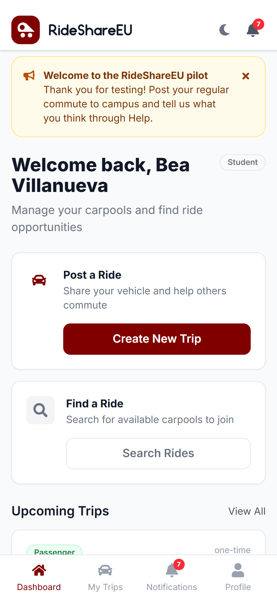<br><b>Dashboard</b></td>
    <td align="center">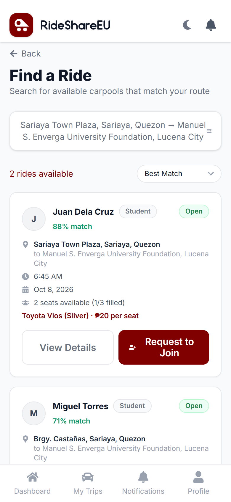<br><b>Find a Ride</b></td>
    <td align="center">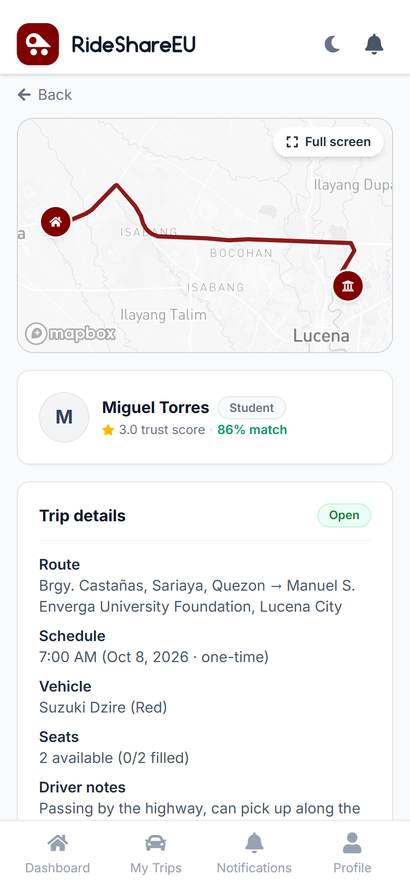<br><b>Ride details</b></td>
  </tr>
  <tr>
    <td align="center">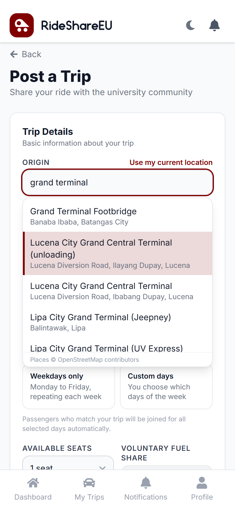<br><b>Post a Trip</b></td>
    <td align="center">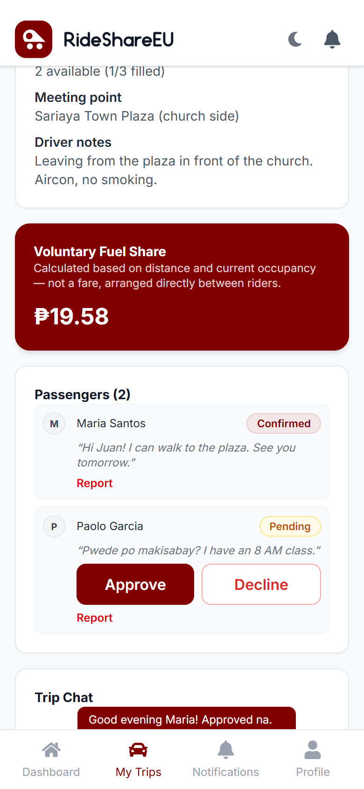<br><b>Driver's trip view</b></td>
    <td align="center">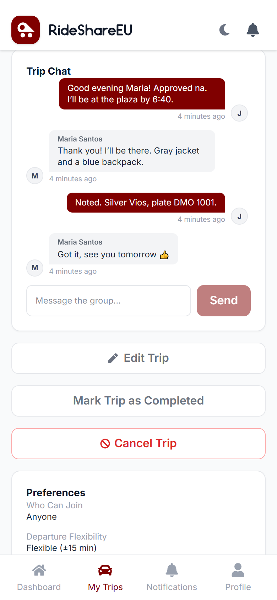<br><b>Trip chat</b></td>
  </tr>
  <tr>
    <td align="center">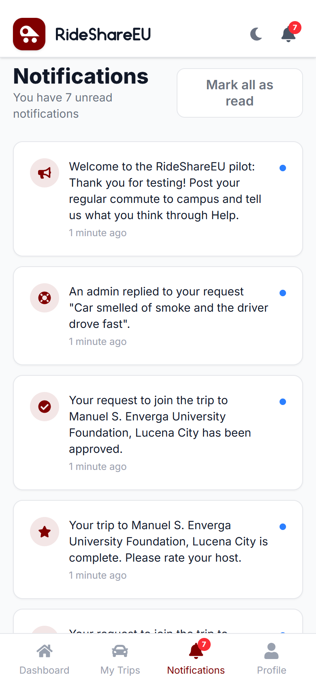<br><b>Notifications</b></td>
    <td align="center">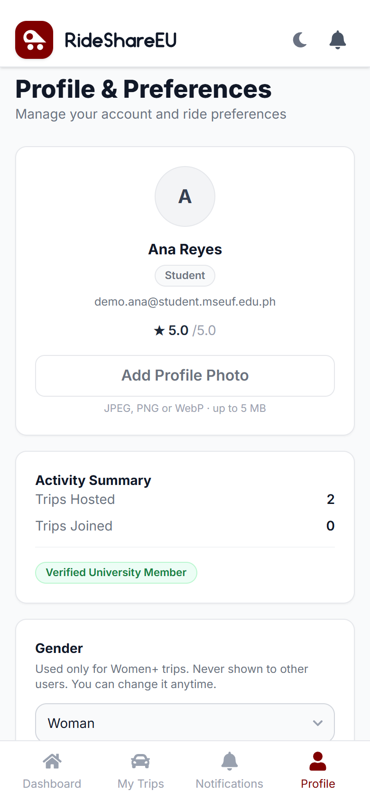<br><b>Profile</b></td>
    <td align="center">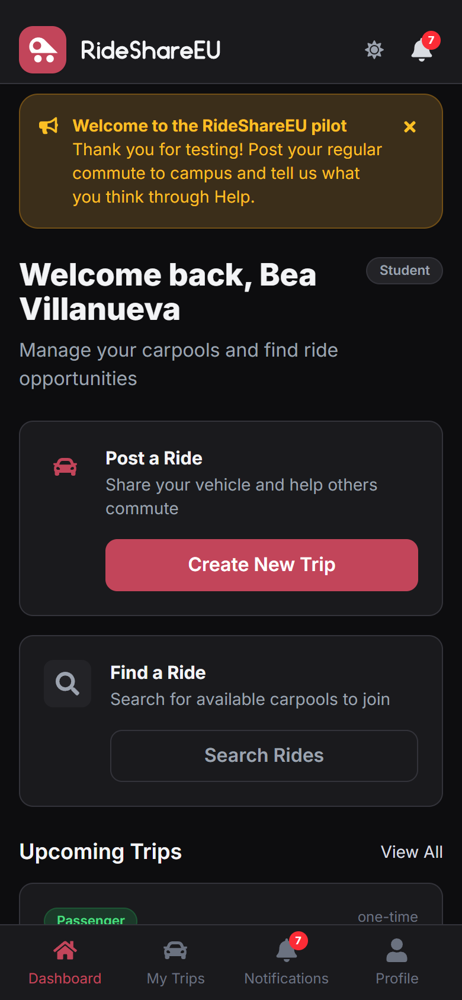<br><b>Dark mode</b></td>
  </tr>
</table>

<p align="center">
  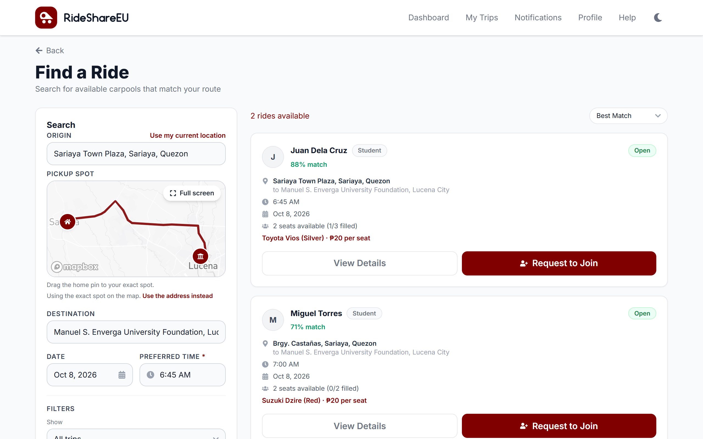<br>
  <b>Find a Ride on desktop</b>
</p>

<p align="center">
  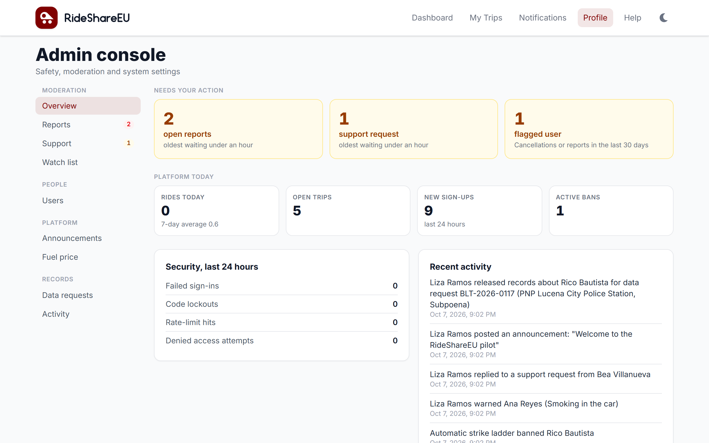<br>
  <b>Admin dashboard</b>
</p>

## Features

**For riders**
- Search by pickup, drop-off, date and time. Results are ranked by match score, with a "Show all" fallback when nothing matches closely.
- Address suggestions as you type (accessible combobox, Philippines only, biased toward Lucena).
- Request a seat, chat with the driver and riders, and follow the car's live location on the day.
- Women+ trips: riders can choose to see only trips open to women and non-binary riders.

**For drivers**
- Post one-time or recurring trips (daily, weekdays or chosen days) with a Mapbox route.
- Fuel share per seat is calculated when the trip is posted and capped by the official fuel price for the car's fuel type.
- Approve or decline requests, edit the trip, and save up to five cars.

**Trust and safety**
- Email verification with a one-time code, university email only.
- Ratings, a trust score, reports, official warnings and automatic suspensions.
- Help page with emergency guidance and a contact-admin form.

**For admins**
- Report review, warnings, bans, trip cancellation, the fuel price cap, announcements and a support inbox.
- A watch list that flags patterns (frequent cancellations, repeated reports) without acting on them.
- An audit log of every admin action. One superadmin (the school's DPO) handles law-enforcement data requests.

## Stack

| Layer | Choice |
|---|---|
| Frontend | Next.js 16 (App Router), React 19, Tailwind CSS 4, TypeScript |
| API | Express 5 on Node.js |
| Database | PostgreSQL 17 through Prisma 7 |
| Maps | Mapbox GL JS (maps and routes), Photon (address suggestions), Nominatim (geocoding) |
| Email | Brevo HTTP API (SMTP locally) |
| Hosting | Vercel (`sin1`) for the web app, Railway (Singapore) for the API and database |
| Monitoring | Sentry (errors), Umami (visits), GitHub Actions (CI and uptime) |
| Testing | Jest (server and web), Postman + Newman (API), Python `unittest` (PSGA validation) |

## Architecture

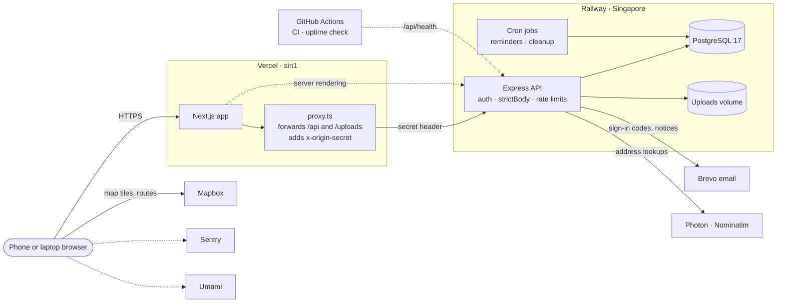

The browser only ever talks to Vercel. The API rejects any request that lacks the origin secret, except the health check, so it can't be called directly.

### How a ride is matched

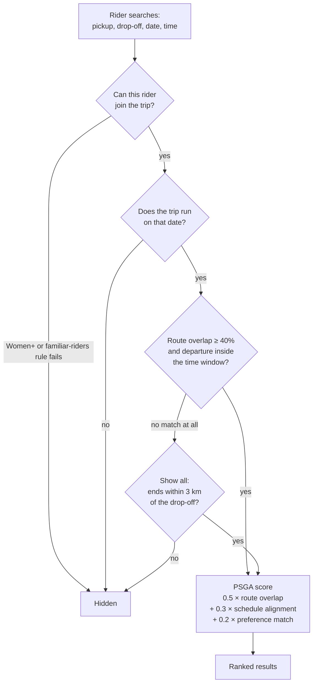

Route overlap is the share of the rider's path that falls within 1.5 km of the driver's route. When nothing passes, the rider can tap "Show all", which drops the overlap and time limits but keeps only trips heading to the same place. The weights live in `server/config/psgaConfig.js`; the validation scripts in `validation/` compare PSGA with other ranking methods against human judgments.

## Security

- Every route except sign-in needs a signed session (HS256 JWT in an httpOnly cookie). The caller's identity always comes from the token, never from the request body.
- Every write route checks its body against a strict schema. Unknown fields, wrong types and identity fields (`userId`, `hostId`, `isAdmin` …) are rejected.
- Ownership checks on every resource, with a per-route test (`crossUserAccess.test.js`) proving another user gets 403 or 404.
- Rate limits on sign-in, codes and password resets, plus per-account limits on everything else.
- Gender, university ID and other personal fields are encrypted at rest (AES-256-GCM).
- Security events are logged without passwords, codes or tokens, and emails are masked.
- The API refuses to start with a weak `JWT_SECRET`, a bad encryption key or a non-HTTPS origin in production.

Full audit: [`docs/security/pre-deploy-audit.md`](docs/security/pre-deploy-audit.md).

## Local setup

Needs Node.js 20+ and PostgreSQL 17 running on `localhost:5432`.

```bash
npm install
createdb -U postgres rideshare_dev

cp .env.example .env              # API: DATABASE_URL, JWT_SECRET, PII_ENCRYPTION_KEY, ...
cp .env.local.example .env.local  # web: JWT_SECRET, NEXT_PUBLIC_API_URL, NEXT_PUBLIC_MAPBOX_TOKEN

npx prisma db push
npm run seed:demo                 # optional: fictional users and trips

npm run server                    # API on http://localhost:4000
npm run dev                       # web on http://localhost:3000
```

- `JWT_SECRET` must be the same in both env files (`openssl rand -base64 32`). `PII_ENCRYPTION_KEY` is 64 hex characters (`openssl rand -hex 32`).
- Leave the SMTP settings blank locally and sign-in codes are printed to the API console.
- Maps need a free Mapbox public token (`pk.…`).

### Scripts

| Command | What it does |
|---|---|
| `npm run dev` | Next.js dev server |
| `npm run server` | Express API |
| `npm test` | All server and web tests |
| `npm run test:api` | Postman collection through Newman (run `npm run seed:postman` first) |
| `npm run seed:demo` | Fill the database with fictional demo data |
| `npm run make-admin <email>` | Make an existing account an admin |
| `npm run make-superadmin <email>` | Set the one superadmin (`--replace` to hand over) |
| `node scripts/backup-db.mjs` | Snapshot every table to `backups/<timestamp>/` as JSON |
| `node scripts/restore-db.mjs [dir] [--force]` | Restore a snapshot and check row counts |

## Deployment

Vercel hosts the web app and Railway hosts the API and PostgreSQL, both in Singapore. Pushing to `main` deploys both. Production backups run weekly through Railway's private tunnel (`scripts/backup-production.ps1`).

Step-by-step guide: [`docs/deployment/railway-vercel.md`](docs/deployment/railway-vercel.md).

## Project structure

```
src/
  app/            Next.js pages (auth/ holds the signed-in app)
  components/     UI components (maps, chat, address input, ...)
  lib/            API client, session, shared rules
  proxy.ts        forwards /api and /uploads to the API in production
server/
  routes/         Express routers
  controllers/    request handlers
  services/       PSGA matching, fuel share, moderation, email, ...
  middleware/     auth, strictBody, rate limits, origin secret
  __tests__/      Jest tests
prisma/           database schema
validation/       PSGA validation datasets and scripts (Python)
postman/          API test collection
scripts/          backup and restore
docs/             deployment, security, policy, evaluation, screenshots
```

## Documentation

- [Deployment guide](docs/deployment/railway-vercel.md)
- [Pre-deploy security audit](docs/security/pre-deploy-audit.md) and [OWASP Top 10 review](docs/security/owasp-top10-review.md)
- [Law-enforcement data requests policy](docs/policy/law-enforcement-data-requests.md)
- [UAT and SUS protocol](docs/evaluation/uat-sus-protocol.md)
- [PSGA human labeling protocol](docs/validation/human-labeling-protocol.md)
- [Brand guidelines](docs/brand/logo/GUIDELINES.md)
